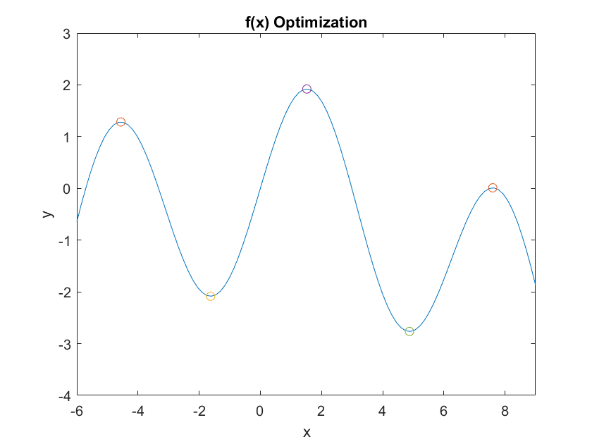
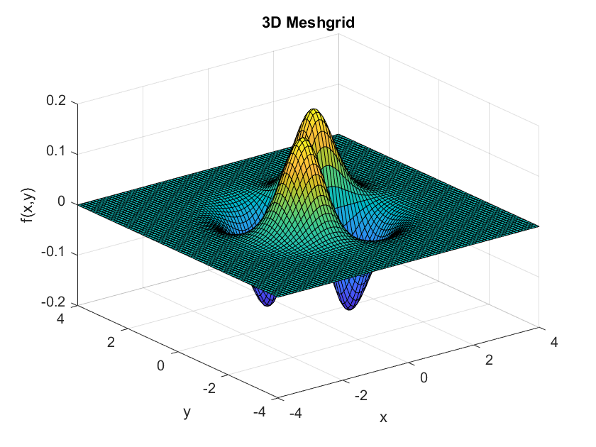
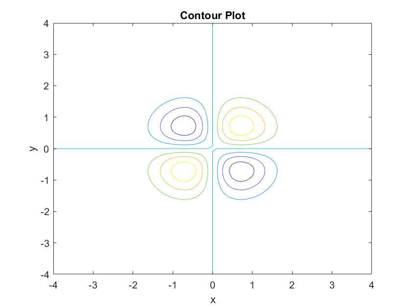

# Single and Multivariable Optimization Methods

## Single Variable Optimization

We will compare a few methods of single variable optimization on the function:

$$f(x) = 2\sin{x} - \frac{x^2}{30}$$

### Expected Results
First we will derive the extrema in the reigon $x\in[-6,9]$ as a control.

$$

f'(x) = 2\cos{x} - \frac{x}{15}\\

f'(x) = 0 \implies x^* = \set{-4.56, -1.625, 1.52, 4.876, 7.598}

$$

Where $x^*$ denotes a critical point on the function $f(x)$.

***Figure 1:** A plot of f(x) where the critical points have been annotated.*

### Golden Section Search
The search area is narrowed according to the golden ratio. Then the algorithm checks which subinterval contains the cricial point and search bounds are adjusted. This process is repeated until a stopping criteria is met. For more details click [here](https://en.wikipedia.org/wiki/Golden-section_search).
$$

\varphi = \frac{1+\sqrt{5}}{2}\\

d = \frac{x_u - x_l}{\varphi}\\

x_1 = x_l + d\\

x_2 = x_u - d\\

$$

This process shrinks the search interval by approximatly 61.8% each iteration.

### Bisection Search
The search area is subdivided into two subsections. The algorithm checks which subinterval contains the cricial point and search bounds are adjusted. This process is repeated until a stopping criteria is met. For more details click [here](https://en.wikipedia.org/wiki/Bisection_method).

$$x_m = \frac{1}{2}(x_u + x_l)$$

This process shrinks the search interval by 50% each iteration.

### Newton-Raphson Method
An intial guess is chosen and the derivative at that guess it taken. The next guess is given by:

$$x_{i+1} = x_i - \frac{f(x)}{f'(x)}$$

This process is repeated until a stopping criteria is met. For more details click [here](https://en.wikipedia.org/wiki/Newton%27s_method).

## Multivariable Optimization

We will compare a few methods of multivariable optimization on the function:

$f(x,y) = x y \exp{-(x^2+y^2)}$

### Expected Results
First we will derive the extrema in the reigon $x,y\in[-5,5]$ as a control.
$$

\frac{\partial{f}}{\partial{x}} = 0 = y(1-2x^2)\exp{-(x^2+y^2)} \\

\frac{\partial{f}}{\partial{y}} = 0 = x(1-2y^2)\exp{-(x^2+y^2)}\\

(x^*,y^*) = \set{(\pm\frac{\sqrt{2}}{2}, \pm\frac{\sqrt{2}}{2})}\\

$$

Where $(x^*,y^*)$ denotes the critical points on the function.

***Figure 2:** A surface plot of f(x,y).*

***Figure 3:** A contour plot of f(x,y).*

The gradient is defined as the "slope of the surface". It is a vector which ponits to the direction of most change and is derived as a vector containing the partial derivatives of the surface with respect to each input.

$$
\nabla f = \begin{bmatrix}
\frac{\partial f}{\partial x} \\
\frac{\partial f}{\partial y}
\end{bmatrix}
$$

The Hessian Matrix is the derivative of the gradient vector. It gives information about the curvature of the surface which lets us classify different kinds of extrema.

$$
\mathbf{H} = \begin{bmatrix}
\frac{\partial^2 f}{\partial x^2} & \frac{\partial^2 f}{\partial x \partial y} \\
\frac{\partial^2 f}{\partial y \partial x} & \frac{\partial^2 f}{\partial y^2}
\end{bmatrix}
$$

### Newton Method

$$
\Delta x \approx -H(x)^{-1}\nabla F(x) \\

x_{i+1} = x_i - \lambda H(x_i)^{-1}\nabla F(x_i)\\
$$

Where $\lambda$ is the step size. For more details click [here](https://en.wikipedia.org/wiki/Newton%27s_method).

### Gradient Ascent/Descent

$$x_{i+1} = x_i - \lambda \nabla F(x_i)\\$$

Where $\lambda$ is the step size parameter. 

When $\lambda \lt 0$,  we are doing gradient ascent; when $\lambda \gt 0$ we are doing gradient descent. For more details click [here](https://en.wikipedia.org/wiki/Gradient_descent).